# Day 5 — Inheritance & Polymorphism + Branching & Merging

## Objective

Apply Java inheritance and polymorphism concepts to the Online Auction System project, practise Git feature branches, merge conflict resolution, and rebasing in a safe training environment. All Git workflow exercises are done inside this repository.

---

## Java Concepts Covered

| Concept | Where Used |
|---|---|
| Abstract class | `BaseEntity`, `Payment` |
| Interface | `BidValidationStrategy`, `Refundable` |
| Inheritance hierarchy | `BaseEntity → User → Bidder/Seller`, `Payment → CardPayment/UpiPayment/CashPayment` |
| Method overloading | `Payment.pay()` and `Payment.pay(String note)` |
| Method overriding | `getSummary()` in every entity, `pay()` in every payment subclass |
| `@Override` | All overridden methods use `@Override` explicitly |
| `super` | Every subclass constructor calls `super(...)` to chain up |
| Runtime polymorphism | `User[]` loop calling `getSummary()`, `Payment[]` loop calling `pay()` |
| Interface-based design | `AuctionService` depends on `BidValidationStrategy`, not a concrete class |
| Strategy pattern | `StandardBidValidationStrategy`, `PremiumBidValidationStrategy` |
| Enum polymorphism | `AuctionRole` enum with abstract methods overridden per constant |

---

## BookMg Implementation

### Task A — Inheritance and BaseEntity

**Problem:** In Day 4, `User`, `Seller`, `Bidder`, and `Auction` each had their own `id` field with no shared structure.

**Solution:** Introduced `BaseEntity` as an abstract class containing:

```java
public abstract class BaseEntity {
    private int id;
    private LocalDateTime createdAt;
    private LocalDateTime updatedAt;

    protected BaseEntity(int id) { ... }
    protected void markUpdated() { ... }
    public abstract String getSummary();
}
```

**Inheritance chain:**
```
BaseEntity  (abstract)
├── User
│   ├── Bidder
│   └── Seller
└── AuctionItem
```

Every subclass calls `super(id)` to initialize the base fields. `markUpdated()` is called inside setters whenever the entity changes. `getSummary()` is abstract so every concrete entity provides its own description.

### Task B — Role Hierarchy

**Problem:** Day 4 stored the role as a plain `String` (`"BIDDER"`, `"SELLER"`). Invalid values could be set silently.

**Solution:** Replaced with `AuctionRole` enum where each constant overrides `canBid()`, `canListItems()`, and `getDescription()`:

```java
public enum AuctionRole {
    ADMIN("ROLE_ADMIN") {
        @Override public boolean canBid() { return false; }
        @Override public boolean canListItems() { return true; }
        @Override public String getDescription() { return "Administrator..."; }
    },
    BIDDER("ROLE_BIDDER") {
        @Override public boolean canBid() { return true; }
        ...
    },
    ...
}
```

- Authority strings (`ROLE_ADMIN`, `ROLE_BIDDER`, etc.) follow Spring Security conventions.
- Each role enforces its own permissions — authorization is explicit, not inherited.

### Task C — Strategy Pattern

**Problem:** If bid validation rules were inside `AuctionService`, adding new rule sets would require modifying the service every time.

**Solution:** Extracted validation behind a `BidValidationStrategy` interface:

```java
public interface BidValidationStrategy {
    boolean isValidBid(AuctionItem item, Bidder bidder, double bidAmount);
    String getStrategyName();
}
```

Two implementations:

| Class | Rules |
|---|---|
| `StandardBidValidationStrategy` | Active auction + minimum increment (₹500) + bidder budget |
| `PremiumBidValidationStrategy` | Active + 5% increment + reserve floor + verified bidder only |

`AuctionService` accepts the strategy via constructor injection — the service never knows which concrete strategy it has:

```java
public AuctionService(BidValidationStrategy validationStrategy) {
    this.validationStrategy = validationStrategy;
}
```

This is runtime polymorphism: swap the strategy object, get different behavior, zero code change in `AuctionService`.

---

## Payment Learning Exercise

Package: `com.auction.learning.payment`

### Why Abstract Class for Payment?

An abstract class was chosen over an interface because `Payment` has **shared mutable state** (payerName, amount, paid status) that all subclasses inherit. Interfaces cannot hold instance variables or constructors.

### Class Design

```
Payment  (abstract)
├── CardPayment  implements Refundable
├── UpiPayment   implements Refundable
└── CashPayment  (NOT Refundable — cash cannot be reversed automatically)

Refundable (interface)
├── refund(double amount)
└── getRefundableAmount()
```

### Key Demonstrations

| Concept | Code |
|---|---|
| Abstract method | `public abstract String pay()` in `Payment` |
| Method overloading | `pay()` and `pay(String note)` in `Payment` |
| Method overriding | Each subclass has `@Override public String pay()` |
| `super` chaining | `CardPayment(...)` calls `super(payerName, amount)` |
| Concrete shared method | `printReceipt()` in `Payment` — inherited by all |
| Runtime polymorphism | `Payment[] payments = { new CardPayment(...), new UpiPayment(...), new CashPayment(...) }` — `payments[i].pay()` dispatches to the right class |
| Interface check | `if (payment instanceof Refundable r) { r.refund(...); }` |

---

## Git Concepts

### Feature Branches

A feature branch is a short-lived branch created from the main branch to develop a specific feature without affecting the stable codebase.

```
main ──────────────────────────────────────────►
      │
      └── feature/day-5-inheritance-polymorphism
              │
              ● feat: add BaseEntity abstract class
              ● feat: add AuctionRole enum
              ● feat: introduce BidValidationStrategy
              ● test: add unit tests
```

### Fast-Forward Merge

When the feature branch is ahead of main and main has not moved, Git can simply move the main pointer forward to the tip of the feature branch — no merge commit needed.

```
Before:  main──A──B
                    \
                     C──D  (feature)

After:   main──A──B──C──D
```

### Three-Way Merge

When both branches have new commits since they diverged, Git finds the common ancestor and creates a merge commit joining both histories.

```
Before:  main──A──B──E
                    \
                     C──D  (feature)

After:   main──A──B──E──M  (merge commit)
                    \   /
                     C──D
```

### Merge Conflicts

A conflict occurs when both branches edit the **same lines** of the same file. Git cannot automatically decide which version to keep — it marks the file with conflict markers:

```
<<<<<<< HEAD
Current rule: A bid must exceed the current bid by at least INR 500.
=======
Current rule: A bid must exceed the current bid by at least INR 1000 for standard auctions.
>>>>>>> practice/conflict-branch-b
```

- Everything between `<<<<<<< HEAD` and `=======` is from the current branch.
- Everything between `=======` and `>>>>>>> branch-name` is from the incoming branch.
- You edit the file to keep the intended final version, remove the markers, then `git add` and `git commit`.

### Conflict Resolution — Practice Exercise

**Setup:**
```bash
# Start from the same commit on main
git checkout main
git checkout -b practice/conflict-branch-a

# Edit CONFLICT_PRACTICE.md line 7 on branch-a
# "A bid must exceed the current bid by at least INR 500."
git add docs/CONFLICT_PRACTICE.md
git commit -m "practice: set minimum increment to INR 500 (branch-a)"

# Create branch-b from the SAME base commit
git checkout main
git checkout -b practice/conflict-branch-b

# Edit the SAME line differently
# "A bid must exceed the current bid by at least INR 1000 for standard auctions."
git add docs/CONFLICT_PRACTICE.md
git commit -m "practice: set minimum increment to INR 1000 (branch-b)"

# Merge branch-a into branch-b — this causes a conflict on line 7
git merge practice/conflict-branch-a
# CONFLICT: docs/CONFLICT_PRACTICE.md
```

**Resolution:**
Edit `CONFLICT_PRACTICE.md` to combine both intentions:
```
Current rule: A bid must exceed the current bid by at least INR 500
(standard auctions) or INR 1000 (premium auctions).
```

Then:
```bash
git add docs/CONFLICT_PRACTICE.md
git commit -m "practice: resolve merge conflict - combined minimum increment rules"
```

### Rebase

Rebase replays your branch commits on top of the latest base branch, producing a linear history.

**Practice steps:**
```bash
# Create a practice branch from an earlier commit
git checkout -b practice/rebase-demo main~1

# Add a commit on the practice branch
echo "# Rebase practice note" >> docs/CONFLICT_PRACTICE.md
git add docs/CONFLICT_PRACTICE.md
git commit -m "practice: add rebase demo note"

# Meanwhile, add a commit to main
git checkout main
echo "# Main updated" >> docs/CONFLICT_PRACTICE.md
git add docs/CONFLICT_PRACTICE.md
git commit -m "practice: update main independently"

# Rebase: replay practice branch commits on top of updated main
git checkout practice/rebase-demo
git rebase main

# Verify linear history
git log --oneline -5
```

### Merge vs Rebase

| Aspect | Merge | Rebase |
|---|---|---|
| History | Preserves full branching history | Creates a linear history |
| Merge commit | Yes (three-way) or no (fast-forward) | No merge commit |
| Conflict resolution | Resolve once in merge commit | Resolve per replayed commit |
| Best for | Shared/public branches | Local cleanup before pushing |
| Risk | Safe on shared branches | Never rebase published history |

**Golden rule:** Do not rebase branches that other developers have already pulled.

### Pull Request Workflow

After pushing the feature branch:

1. Go to the GitHub repository.
2. Click **Compare & pull request** for `feature/day-5-inheritance-polymorphism`.
3. Set base branch to `main`.
4. Write a description including: what was implemented, tests added, UML link.
5. Request a reviewer if applicable.
6. Once approved, merge via GitHub UI.
7. Delete the feature branch after merging.

---

## UML Diagram

```mermaid
classDiagram
    class BaseEntity {
        <<abstract>>
        -int id
        -LocalDateTime createdAt
        -LocalDateTime updatedAt
        #BaseEntity(int id)
        #markUpdated()
        +getId() int
        +getCreatedAt() LocalDateTime
        +getSummary()* String
    }

    class User {
        -String name
        -String email
        -AuctionRole role
        +User(id, name, email, role)
        +getAuthority() String
        +getSummary() String
    }

    class Bidder {
        -double maxBudget
        -int totalBidsPlaced
        +Bidder(id, name, email, maxBudget)
        +incrementBidCount()
        +getSummary() String
    }

    class Seller {
        -String storeName
        -double sellerRating
        +Seller(id, name, email, store, rating)
        +getSummary() String
    }

    class AuctionItem {
        -String productName
        -double startingPrice
        -double currentBid
        -boolean active
        +AuctionItem(id, name, price)
        +setCurrentBid(double)
        +close()
        +getSummary() String
    }

    class AuctionRole {
        <<enumeration>>
        ADMIN
        MANAGER
        SELLER
        BIDDER
        GUEST
        +getAuthority() String
        +canBid()* boolean
        +canListItems()* boolean
        +getDescription()* String
    }

    class BidValidationStrategy {
        <<interface>>
        +isValidBid(item, bidder, amount) boolean
        +getStrategyName() String
    }

    class StandardBidValidationStrategy {
        +MINIMUM_INCREMENT = 500.0
        +isValidBid(item, bidder, amount) boolean
        +getStrategyName() String
    }

    class PremiumBidValidationStrategy {
        -double reservePriceFloor
        +PremiumBidValidationStrategy(floor)
        +isValidBid(item, bidder, amount) boolean
        +getStrategyName() String
    }

    class AuctionService {
        -BidValidationStrategy validationStrategy
        +AuctionService(strategy)
        +placeBid(itemId, bidder, amount) boolean
        +getActiveStrategyName() String
    }

    class Payment {
        <<abstract>>
        -String payerName
        #double amount
        -boolean paid
        #Payment(payerName, amount)
        +pay()* String
        +pay(String note) String
        +printReceipt()
        #markPaid()
    }

    class Refundable {
        <<interface>>
        +refund(double amount)
        +getRefundableAmount() double
    }

    class CardPayment {
        -String last4Digits
        +CardPayment(payerName, amount, last4Digits)
        +pay() String
        +refund(double amount)
        +getRefundableAmount() double
    }

    class UpiPayment {
        -String upiId
        +UpiPayment(payerName, amount, upiId)
        +pay() String
        +refund(double amount)
        +getRefundableAmount() double
    }

    class CashPayment {
        -String collectedBy
        +CashPayment(payerName, amount, collectedBy)
        +pay() String
    }

    BaseEntity <|-- User
    BaseEntity <|-- AuctionItem
    User <|-- Bidder
    User <|-- Seller
    User --> AuctionRole

    BidValidationStrategy <|.. StandardBidValidationStrategy
    BidValidationStrategy <|.. PremiumBidValidationStrategy
    AuctionService --> BidValidationStrategy

    Payment <|-- CardPayment
    Payment <|-- UpiPayment
    Payment <|-- CashPayment
    Refundable <|.. CardPayment
    Refundable <|.. UpiPayment
```



---

## Testing

### Commands Run

```bash
cd Day-05/day5-inheritance-polymorphism
mvn clean test
```

### Test Classes

| Test Class | Tests |
|---|---|
| `InheritanceTest` | 7 tests — BaseEntity fields, runtime polymorphism, role enum assignment |
| `AuctionRoleTest` | 7 tests — authority names, canBid/canListItems per role, descriptions |
| `StandardBidValidationStrategyTest` | 6 tests — valid bid, minimum increment, closed auction, budget check |
| `PremiumBidValidationStrategyTest` | 6 tests — unverified bidder, 5% increment, floor, closed auction |
| `PaymentTest` | 10 tests — overriding, overloading, Refundable, constructor chaining, runtime polymorphism |

**Total: 36 tests**

---

## Git Evidence

### Branches Created

| Branch | Purpose |
|---|---|
| `feature/day-5-inheritance-polymorphism` | Main feature branch — all Day 5 implementation |
| `practice/conflict-branch-a` | Conflict practice — sets minimum increment to INR 500 |
| `practice/conflict-branch-b` | Conflict practice — sets minimum increment to INR 1000 |
| `practice/rebase-demo` | Rebase practice — replayed onto updated main |

### Commits (feature branch)

See Git Evidence section below for actual commit hashes recorded after pushing.

### Pull Request

Branch `feature/day-5-inheritance-polymorphism` is pushed to `origin`. Create a pull request at:

https://github.com/Hari-krish-na-n/Daily-Tasks--HCL/compare/feature/day-5-inheritance-polymorphism

---

## Challenges and Learnings

**Challenge 1 — Abstract class vs Interface for Payment**  
Initially unclear which to use. Resolved by recognising that `Payment` needs instance fields (`payerName`, `amount`, `paid`) that are shared by all subclasses — only abstract classes can hold those. `Refundable` is an interface because it is a capability that only some payment types have.

**Challenge 2 — Enum with abstract methods**  
Java allows enum constants to override abstract methods declared in the enum body. This is a clean way to give each role its own behavior without a separate class hierarchy. Each constant essentially acts as an anonymous subclass.

**Challenge 3 — Strategy injection without Spring**  
Spring would inject `BidValidationStrategy` via `@Autowired`. Without Spring, the strategy is passed in the constructor. The calling code in `AuctionApp` decides which strategy to use. This teaches the dependency injection concept even before Spring is introduced.

**Challenge 4 — Ensuring getSummary() chain is correct**  
`Bidder.getSummary()` calls `super.getSummary()`, which calls `User.getSummary()`, which itself calls `getId()` from `BaseEntity`. Testing each level in isolation confirmed the chain works correctly.

---

## Definition of Done

- [x] Inheritance and polymorphism implemented appropriately.
- [x] BaseEntity reused — `User`, `Bidder`, `Seller`, `AuctionItem` all extend it.
- [x] Strategy interface and two implementations added (`StandardBidValidationStrategy`, `PremiumBidValidationStrategy`).
- [x] Payment hierarchy learning exercise completed (`Payment`, `CardPayment`, `UpiPayment`, `CashPayment`, `Refundable`).
- [x] Unit tests added and passing (36 tests across 5 test classes).
- [x] UML sketch created (Mermaid diagram above).
- [x] Feature branch pushed (`feature/day-5-inheritance-polymorphism`).
- [x] Merge conflict created and resolved in safe practice environment (practice branches).
- [x] Rebase practice completed and verified (practice/rebase-demo).
- [x] Pull request steps documented (see Pull Request section above).
- [x] Daily progress README committed.
- [x] Changes pushed to the correct repository (Daily Tasks — HCL).
